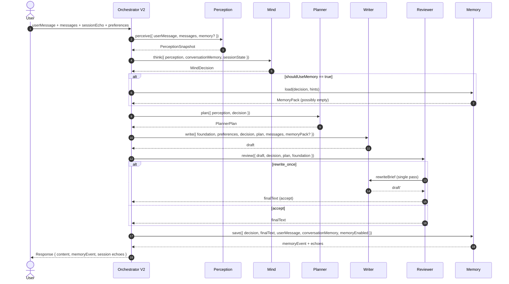
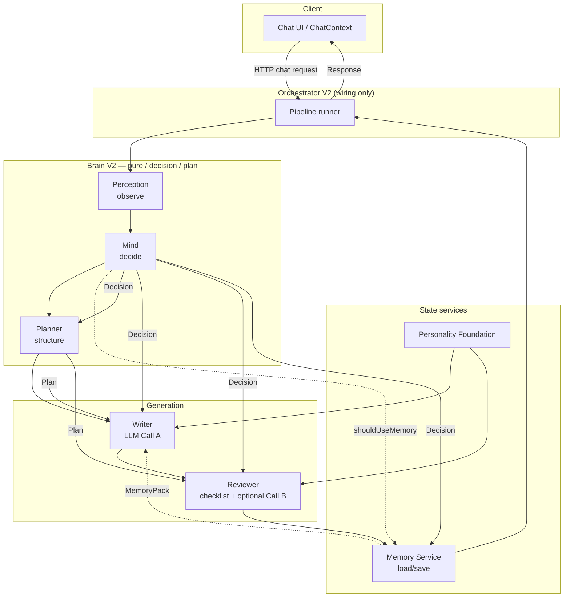

# LAIfe V2 — Data Flow Architecture

**Documento:** `V2_DATA_FLOW.md`  
**Tipo:** specifica di flusso dati (solo progettazione)  
**Stato moduli runtime:** Perception / Mind / Planner implementati e isolati; Writer / Reviewer / Memory Service ancora da formalizzare come runtime  
**Fonti vincolanti:** `LAIFE_V2_ARCHITECTURE.md`, `PERCEPTION_SPEC.md`, `MIND_SPEC.md`, `PLANNER_SPEC.md`  
**Regola di questo documento:** nessun codice runtime nuovo; nessuna modifica V1.

---

## 0. Pipeline canonica

```
User
  ↓
Perception
  ↓
Conversation Signals ← WHAT SIGNALS ARE PRESENT THIS TURN
  ↓
Conversation State   ← WHAT IS CURRENTLY TRUE
  ↓
Mind                 ← strategy + Adaptive Response Profile (HOW bias)
  ↓
Planner              ← WHAT SHOULD HAPPEN NEXT (+ constrain profile)
  ↓
Writer               ← HOW TO SAY IT (consumes profile; no independent inference)
  ↓
Contract Evaluator   ← WHAT + adaptive HOW fidelity (≤1 rewrite)
  ↓
State Transition
  ↓
Response (+ conversationState echo)
```

Memory V2 (durable user knowledge) remains **outside** the live V2 path for now.

### Conversation State vs Memory

| | Conversation State | Memory |
|--|-------------------|--------|
| Lifetime | Short-lived session / conversation working state | Durable user/context knowledge |
| Storage (Phase 3+) | Client session echo (`conversationState`) | Not wired in live V2 yet |
| Contents | topic, goal, mode, phase, engagement, pending proposal, continuity, responseProfile, recentOpeners | facts, preferences, long-term profile |

### Lettura del flusso

1. L’utente invia un messaggio (e stato di sessione, incluso `conversationState` echo).
2. **Perception** osserva e produce uno snapshot strutturato.
3. **Conversation Signals** deriva cue di turno condivisi (affect/style/interaction/engagement) — osservazioni, non decisioni.
4. **Conversation State** evolve i fatti della situazione da `previousState` + messaggi + Signals.
5. **Mind** decide strategia e deriva l’**Adaptive Response Profile** (consumando Signals).
6. **Planner** traduce la decisione in piano + writer brief e può vincolare il profilo (mai il WHAT).
7. **Writer** genera la bozza testuale seguendo piano + profilo (senza re-inferire un profilo conflittuale).
8. **Contract Evaluator** verifica fedeltà al contratto WHAT + delivery HOW (usa Signals per contesto); al massimo **una** riscrittura HOW.
9. **State Transition** pubblica `nextConversationState` solo se Writer ha consegnato.
10. **Response** torna al client (testo + echo di `conversationState`).

### Autorità (Phase 4–6)

| Domanda | Owner |
|--------|--------|
| Quali cue di turno sono presenti? | Conversation Signals (observations only) |
| Cosa è vero ora nella conversazione? | Conversation State |
| Quale bias di comunicazione usare? | Mind (Adaptive Response Profile) |
| Cosa deve fare LAIfe al prossimo turno? | Planner (Mind + Director) |
| Come dirlo? | Writer (consumes profile) |
| Il testo rispetta WHAT + delivery HOW? | Contract Evaluator (fidelity only; no planning) |
| Chi pubblica lo State del prossimo turno? | Runtime / State Transition |
| Short-reply intent contestuale? | `short-reply.js` (autorità) |

Focus / Resume restano helper: **non** autorità concorrenti su `activeTopic`.
`conversationMomentum` è un alias deprecato di `conversationMode`.

### Nota su Memory in lettura

`shouldUseMemory` nasce in **Mind** (decisione).  
Il **retrieve** di fatti (Memory Pack) è un’operazione autorizzata di servizio, non un secondo decision-maker.  
Nel flusso lineare di questo documento, Memory compare come stadio di **scrittura post-Reviewer**.  
Il pack in lettura, se presente, entra nel Writer come input collaterale **già filtrato**, mai come riapertura di Perception/Mind.

```
Mind.shouldUseMemory === true
        │
        ▼
 Memory.load (servizio) ──► MemoryPack ──► Writer (input opzionale)
        │
        └── non modifica Decision, non riscrive Perception
```

---

## 1. Moduli — contratti completi

---

### 1.1 User (bordo sistema)

#### Input
- Azione umana: testo, eventuale voice/attachments UI, settings.

#### Output verso la pipeline
```ts
{
  userMessage: string,
  messages: Array<{ role: 'user'|'assistant', content: string }>, // storia limitata
  sessionEcho?: {
    conversationMemoryMap?,
    conversationPreferenceProfile?,
    learningSignals?,
    welcomeSession?,
    pendingAutomation?,
    voiceSession?
  },
  preferences?: {
    displayName?, personalityBias?, replyLength?, useEmojis?, customInstructions?,
    memoryEnabled?: boolean
  },
  attachments?: Array<{ type: 'image'|'document', name?, url? }>
}
```

#### Responsabilità
- Fornire il turno corrente e lo stato client.
- Non conoscere Perception/Mind/Planner.

#### Cosa NON può fare
- Chiamare OpenAI.
- Scrivere nel brain-memory server direttamente (solo via API dedicate / risultato pipeline).

#### Invarianti
- `userMessage` è la verità del turno utente.
- Gli echo di sessione sono opachi al prodotto UI (non mostrati come “cervello”).

#### Error handling
- Validazione client minima; errori di rete gestiti in UI.
- Server sanitizza comunque (fail-soft).

#### Future extensions
- Modalità voice streaming; attachment multimodali; lifeContext.

---

### 1.2 Perception

**Domanda:** *Cosa sta succedendo?*  
**Runtime attuale:** `lib/server/v2/brain/perception.js` (`perceive`)

#### Input
```ts
{
  userMessage: string,
  messages?: Array<{ role, content }>,
  memory?: Array<{ text?|content?, type? }> | null  // solo contesto osservativo già filtrato
}
```

#### Output — Perception Snapshot / PerceptionResult
```ts
{
  language,
  intent,
  socialIntent,
  emotionalState,
  conversationStage,
  knowledgeLevel,
  userNeed,
  confidence,          // 0..1
  reasoning: {
    signals: string[],
    alternatives: Array<{ intent, score }>,
    notes: string[]
  }
}
```

#### Responsabilità
- Classificare segnali osservabili.
- Stimare confidenza e alternative.
- Restituire uno snapshot completo anche su input poveri.

#### Cosa NON può fare
- Decidere strategy / askQuestion / teach / comfort / tools.
- Generare testo o prompt.
- Chiamare OpenAI.
- Persistire o decidere retrieve/save memoria.
- Importare V1.

#### Invarianti
- Output sempre con tutte le chiavi del contratto.
- Nessun campo decisionale (`askQuestion`, `tools`, `openingPolicy`, …).
- Funzione pura; nessun side effect.
- `reasoning` è diagnostico, non istruzione al Writer.

#### Error handling
- Input malformato → normalizzazione + snapshot `unclear`/`silence` a bassa confidence.
- Mai throw verso l’orchestratore per dati sporchi.

#### Future extensions
- Classificatori più ricchi (senza diventare Mind).
- Signal schema versionato.
- Opzionale modello dedicato di sola classificazione (fuori critical path default).

---

### 1.3 Mind

**Domanda:** *Cosa facciamo in questo turno?*  
**Runtime attuale:** `lib/server/v2/brain/mind.js` (`think`)  
**Sinonimo architetturale:** Director

#### Input
```ts
{
  perception: PerceptionResult,
  conversationMemory: ConversationMemory,  // read-only
  sessionState: SessionState               // read-only
}
```

`ConversationMemory` (es.): topics, currentTopic, openQuestions, explained, turnCount, lastUserStance, unresolvedGoal.  
`SessionState` (es.): memoryEnabled, isVoice, questionStreak, initiativeStreak, userAskedToLead, closingSignal, preferenceBias.

#### Output — Mind Decision
```ts
{
  need,
  goal,                 // machine-oriented
  strategy,
  initiative,           // none | one_insight | one_spark | one_direction
  emotionalTone,
  responseDepth,
  shouldUseMemory,
  shouldContinueTopic,
  shouldAskQuestion,
  shouldTeach,
  shouldComfort,
  shouldChallenge,
  confidence
}
```

#### Responsabilità
- Unica autorità decisionale del turno.
- Chiudere un Decision Record immutabile per il turno.
- Applicare policy di prodotto (question economy, comfort vs challenge, close, …).

#### Cosa NON può fare
- Scrivere testo utente.
- Generare prompt Writer.
- Mutare ConversationMemory / SessionState.
- Chiamare OpenAI.
- Rieseguire Perception.
- Recuperare memoria da DB (solo flag `shouldUseMemory`).

#### Invarianti
- Al più una iniziativa non banale **oppure** una domanda (coda singola a livello policy).
- `shouldComfort === true` ⇒ `shouldChallenge === false`.
- `strategy === 'close'` ⇒ no question, initiative none, no continue topic.
- Decision tipizzata, serializzabile, leggibile in < 30s.
- Pura; nessun side effect.

#### Error handling
- Perception/memory/session malformati → default conservativi (`unclear` / `answer` / flag false).
- Mai throw per input sporchi.

#### Future extensions
- Policy tables data-driven.
- Tool policy esplicita (`tools[]`) oltre memory.
- Telemetria shadow del Decision Record.

---

### 1.4 Planner

**Domanda:** *Come organizziamo la risposta, dato che Mind ha già deciso?*  
**Runtime attuale:** `lib/server/v2/brain/planner.js` (`plan`)

#### Input
```ts
{
  perception: PerceptionResult,
  decision: MindDecision
}
```

Non riceve testo utente.  
Non riceve ConversationMemory/SessionState (già consumati da Mind).

#### Output — Planner Plan
```ts
{
  objective: string,
  conversationPlan: {
    opening: { role:'opening', kind, purpose },
    development: Array<{ role:'development', kind, purpose }>,
    closing: { role:'closing', kind, purpose },
    lengthBand: 'minimal'|'light'|'balanced'|'deep',
    beatCount: number
  },
  writerBrief: {
    language, tone, depth, strategy, need, moveSummary,
    must: string[],
    mustNot: string[],
    coda: 'none'|'question'|'insight'|'spark'|'direction',
    memoryHint: 'omit'|'weave_soft'|'allowed',
    teaching, comfort, challenge, continueTopic
  },
  constraints: string[],
  confidence: number
}
```

#### Responsabilità
- Tradurre Decision → struttura + istruzioni Writer.
- Usare Perception solo come contesto già osservato (lingua, knowledgeLevel, …).
- Far vincere **sempre** Decision su Perception in caso di tensione.

#### Cosa NON può fare
- Nuove decisioni (non accendere `askQuestion` se Mind l’ha lasciato false).
- Analizzare il messaggio utente.
- Chiamare OpenAI.
- Generare la risposta finale.
- Modificare memoria.
- Importare V1 / dipendere runtime da perception.js o mind.js.

#### Invarianti
- `conversationPlan.*.purpose` descrive struttura, non prosa utente.
- Coda: question esclude initiative; close ⇒ coda `none` (invariant packaging).
- Comfort ⇒ `writerBrief.challenge === false`.
- `constraints` derivano solo dalla Decision.
- Funzione pura.

#### Error handling
- Decision/perception incompleti → defaults (`answer`, depth `balanced`) + confidence ridotta.
- Mai throw per input sporchi.

#### Future extensions
- `memoryPack?: MemoryPack` opzionale in input senza rompere il contratto base.
- Template strategy data-driven.
- Versioning `PLANNER_VERSION` nel payload orchestratore.

---

### 1.5 Writer

**Domanda:** *Come lo diciamo, in voce LAIfe?*  
**Runtime:** da implementare (non esiste ancora come modulo V2 isolato)

#### Input
```ts
{
  personalityFoundation: string | IdentityBlock,  // solo identità
  preferences?: UserPreferences,                  // soft constraints
  decision: MindDecision,                         // autorità
  plan: PlannerPlan,                              // struttura + brief
  messages: ChatMessage[],                        // input conversazione
  memoryPack?: MemoryPack | null,                 // solo se autorizzato
  toolFacts?: ToolFact[] | null                   // futuro
}
```

#### Output
```ts
{
  draft: string,           // unica bozza candidata
  meta?: { model?, usage? } // infra, non prodotto
}
```

#### Responsabilità
- Generare prosa naturale eseguendo Foundation + Decision + Plan (+ MemoryPack).
- Unica Call LLM primaria del turno (prevista).

#### Cosa NON può fare
- Rinegoziare intent/strategy/askQuestion/memory policy.
- Auto-invocare rewrite (solo Reviewer).
- Citare moduli interni.
- Inventare memorie/tool results.
- Chiamare Perception/Mind/Planner.

#### Invarianti
- Obbedienza ai `constraints` / `writerBrief.must|mustNot`.
- Output = solo testo assistant (più meta infra opzionale).
- Lingua sticky secondo brief.
- Nessun secondo Decision Record.

#### Error handling
- Fallimento modello → errore orchestratore (o fallback di piattaforma); non “inventare” un piano alternativo.
- Draft vuoto → fail verso Reviewer/orchestratore (502-equivalent), non silent invent.

#### Future extensions
- Streaming token; voice utterance shaping; multimodal caption merge.

---

### 1.6 Reviewer

**Domanda:** *Questa bozza è accettabile?*  
**Runtime:** da implementare

#### Input
```ts
{
  draft: string,
  decision: MindDecision,
  plan: PlannerPlan,
  personalityFoundation: IdentityBlock
}
```

#### Output
```ts
{
  status: 'accept' | 'rewrite_once',
  finalText: string,
  rewriteBrief?: string,   // solo se rewrite_once
  violations?: string[]    // diagnostica interna
}
```

#### Responsabilità
- Una checklist unica di qualità/fedeltà.
- Al massimo **una** riscrittura LLM.
- Pubblicare testo finale accettabile.

#### Cosa NON può fare
- Re-plan / richiamare Mind.
- Loop multipli di rewrite.
- Cambiare Memory policy o Intent.
- Esporre score all’utente.

#### Invarianti
- Budget rewrite ≤ 1.
- Hard fail riparabili → una rewrite; soft fail minori → accept.
- Fedeltà a Decision > bellezza stilistica.
- Comfort/challenge e askQuestion devono restare coerenti col Decision.

#### Error handling
- Rewrite fallita o troppo corta → keep draft originale se hard checks passano; altrimenti escalate orchestratore.
- Fail-soft preferito su eccezioni interne di scoring.

#### Future extensions
- Checklist versionata; shadow scoring; A/B soglie.

---

### 1.7 Memory

**Domanda:** *Cosa ricordiamo / recuperiamo / salviamo?*  
**Runtime:** da formalizzare come Memory Service V2 (oggi esiste brain-memory V1, fuori wiring V2)

#### Input (write path — stadio pipeline di questo documento)
```ts
{
  decision: MindDecision,          // especially shouldUseMemory / need
  finalText: string,               // dopo Reviewer
  userMessage: string,
  conversationMemory: ConversationMemory,
  sessionState: SessionState,
  memoryEnabled: boolean
}
```

#### Input (read path — collaterale autorizzato)
```ts
{
  decision: MindDecision,          // must have shouldUseMemory === true
  queryHints: { intent?, topic?, userMessage? }
}
→ MemoryPack
```

#### Output (write path)
```ts
{
  memoryEvent: 'saved' | 'updated' | null,
  conversationMemoryOut: ConversationMemory,
  temporaryStateOut?: SessionEchoPatches
}
```

#### Output (read path)
```ts
{
  items: Array<{ id?, text, type?, relevance?, epistemic? }>,  // max N
  weaveHint: 'omit' | 'soft_bridge' | 'explicit_callback'
}
```

#### Responsabilità
- Tre livelli: permanente / conversazione / temporanea (vedi architecture §6).
- Filtrare, rankare, salvare senza stile.
- Onorare `memoryEnabled` e Decision.

#### Cosa NON può fare
- Decidere strategy conversazionale.
- Scrivere writerBrief / prompt di personalità.
- Inventare ricordi.
- Esporre storage all’utente.

#### Invarianti
- No save se `memoryEnabled === false` o Decision lo vieta.
- Permanente ≠ temporanea (learning signals non diventano fatti).
- Pack di lettura corto e priorizzato.
- Operazioni di servizio; non “engine di personalità”.

#### Error handling
- Timeout/budget su save (fail-soft: risposta utente comunque consegnata).
- Retrieve fallita → MemoryPack vuoto; Writer procede senza inventare.

#### Future extensions
- Promote temporary → permanent con criteri stretti.
- Dedup semantico; privacy controls.

---

### 1.8 Response (bordo uscita)

#### Input
- `finalText` (Reviewer)
- `memoryEvent` / echo aggiornati (Memory)

#### Output client
```ts
{
  content: string,
  memoryEvent?: 'saved'|'updated'|null,
  learningSignals?,
  conversationMemoryMap?,
  conversationPreferenceProfile?,
  welcomeSession?,
  pendingAutomation?,
  voiceSession?
}
```

#### Responsabilità
- Consegnare solo ciò che il client deve vedere/ripetere.
- Non includere Decision/Plan/reasoning/scores.

#### Cosa NON può fare
- Esporre cognitiveBlock, writerBrief grezzo, gate scores.

#### Invarianti
- `content` è l’unica superficie conversazionale.
- Echo interni non renderizzati come chat.

#### Error handling
- Errori HTTP tipizzati; nessun leak di stack interni.

#### Future extensions
- Stream events; partial voice commits.

---

## 2. Collegamenti — contratti di passaggio

Per ogni edge: **trasferito**, **vietato**, **ownership**, **contratto**.

---

### 2.1 User → Perception

| | |
|--|--|
| **Trasferito** | `userMessage`, `messages` (storia limitata), opzionale `memory` già filtrata solo come contesto osservativo |
| **NON trasferito** | Decision, Plan, Personality behavior rules, tool results, prompt di sistema completo |
| **Owner** | User owns raw text; Orchestrator owns sanitization limits |
| **Contratto** | Perception riceve solo dati osservabili del turno. Nessuna istruzione “come rispondere”. |

---

### 2.2 Perception → Mind

| | |
|--|--|
| **Trasferito** | Intero Perception Snapshot (`language`, `intent`, `socialIntent`, `emotionalState`, `conversationStage`, `knowledgeLevel`, `userNeed`, `confidence`, `reasoning`) |
| **NON trasferito** | Testo utente grezzo (Mind non lo rianalizza), bozze, prompt, MemoryPack DB |
| **Owner** | **Perception** owns lo snapshot fino a consumo; Mind non lo muta |
| **Contratto** | Mind tratta Perception come fatto osservativo. `reasoning` è opzionale/diagnostico; le decisioni usano i campi tipizzati. Mind riceve **anche** `conversationMemory` + `sessionState` dall’orchestratore (non da Perception). |

**Chiarimento ownership input Mind:**

| Dato | Owner | Producer |
|------|-------|----------|
| Perception Snapshot | Perception module | `perceive` |
| ConversationMemory | Memory/Conversation layer | session echo + aggiornamenti |
| SessionState | Session/Temp layer | client echo + server flags |

---

### 2.3 Mind → Planner

| | |
|--|--|
| **Trasferito** | Mind Decision completa + Perception Snapshot (per contesto lingua/knowledge/stage) |
| **NON trasferito** | `conversationMemory`, `sessionState`, testo utente, MemoryPack, Personality Foundation |
| **Owner** | **Mind** owns Decision (immutabile per il turno). Planner è consumer read-only |
| **Contratto** | Planner non può invertire flag Decision. Perception non riapre il caso: **Decision wins**. |

Dati Decision che il Planner deve rispettare alla lettera:

- `strategy`, `need`, `initiative`
- `shouldAskQuestion`, `shouldTeach`, `shouldComfort`, `shouldChallenge`
- `shouldContinueTopic`, `shouldUseMemory`
- `emotionalTone`, `responseDepth`, `goal`

---

### 2.4 Planner → Writer

| | |
|--|--|
| **Trasferito** | `PlannerPlan` (`objective`, `conversationPlan`, `writerBrief`, `constraints`, `confidence`) + (via orchestratore) Decision, Personality Foundation, messages, optional MemoryPack |
| **NON trasferito** | `reasoning` Perception grezzo (non necessario), ConversationMemory grezza, SessionState, istruzioni V1 mesh |
| **Owner** | **Planner** owns Plan; Writer non lo modifica (può solo eseguirlo) |
| **Contratto** | Writer esegue `writerBrief.must/mustNot` e la struttura fasi. Non crea un secondo piano. |

**Minimo sufficiente al Writer:**

1. Personality Foundation  
2. `writerBrief` (+ `constraints`)  
3. `messages`  
4. MemoryPack se `memoryHint !== 'omit'` e pack disponibile  

Decision può viaggiare insieme per Reviewer downstream, ma il Writer non deve “reinterpretare” oltre il brief.

---

### 2.5 Writer → Reviewer

| | |
|--|--|
| **Trasferito** | `draft: string` (+ Decision + Plan per verifica fedeltà) |
| **NON trasferito** | Log LLM grezzi all’utente; nuovi flag decisionali |
| **Owner** | Writer owns draft fino ad accept; Reviewer owns esito accept/rewrite |
| **Contratto** | Reviewer valuta draft contro Decision/Plan/Foundation. Rewrite brief corto, una volta sola. |

---

### 2.6 Reviewer → Memory

| | |
|--|--|
| **Trasferito** | `finalText`, Decision (policy save), `userMessage`, ConversationMemory corrente, `memoryEnabled` |
| **NON trasferito** | Plan completo obbligatorio (opzionale diagnostica), prompt Writer, reasoning Perception |
| **Owner** | Reviewer owns `finalText`; Memory owns persistenza e aggiornamento map/temporanea |
| **Contratto** | Memory scrive solo se autorizzata. Fallimenti save non bloccano la Response. |

---

### 2.7 Memory → Response

| | |
|--|--|
| **Trasferito** | `memoryEvent`, echo aggiornati (map/profile/session patches) |
| **NON trasferito** | Dump DB, score retrieve, fatti non selezionati |
| **Owner** | Memory owns eventi; Orchestrator assembla payload Response |
| **Contratto** | Client riceve solo `content` + echo necessari. |

---

### 2.8 Orchestratore (implicito) — non è un “brain module”

L’orchestratore V2 (futuro, non mesh V1) è l’unico componente che:

- chiama i moduli in ordine;
- passa i payload tra stadi;
- invoca Memory.load se `shouldUseMemory`;
- invoca LLM solo in Writer / eventuale Reviewer rewrite;
- assembla Response.

**Non** prende decisioni di prodotto (quelle sono di Mind).  
**Non** riscrive Plan.  
**Non** concatena advisor V1.

---

## 3. Ownership globale delle informazioni

| Informazione | Owner canonico | Consumatori legittimi |
|--------------|----------------|------------------------|
| Raw user text | User / Orchestrator (sanitized copy) | Perception; Writer (via messages); Memory save |
| Perception Snapshot | Perception | Mind, Planner (contesto), Reviewer (raro) |
| ConversationMemory | Memory (conversation level) | Mind (read), Memory (write) |
| SessionState / temporary | Session layer | Mind (read), Memory/Response (echo) |
| Mind Decision | Mind | Planner, Writer, Reviewer, Memory |
| Planner Plan / writerBrief | Planner | Writer, Reviewer |
| Personality Foundation | Brand/Identity layer | Writer, Reviewer |
| MemoryPack | Memory | Writer (se autorizzato) |
| Draft | Writer | Reviewer |
| Final text | Reviewer | Memory, Response |
| Client Response payload | Orchestrator | UI |

---

## 4. Sequence Diagram



---

## 5. Component Diagram



---

## 6. Dependency Rules

### 6.1 Direzione delle dipendenze (consentita)

```
User/UI
  → Orchestrator
      → Perception          (nessuna dipendenza brain a valle)
      → Mind                (dipende solo dal *contratto* Perception, non obbligatoriamente dall'import)
      → Planner             (contratti Perception + Mind)
      → Writer              (contratti Decision + Plan + Foundation + MemoryPack)
      → Reviewer            (Draft + Decision + Plan + Foundation)
      → Memory              (Decision + finalText + state)
```

### 6.2 Vietato

| Dipendenza | Perché è vietata |
|------------|------------------|
| Perception → Mind/Planner/Writer | L’osservatore non conosce i decisori |
| Mind → Planner/Writer implementation | Mind non pianifica/scrive |
| Planner → Mind.think() / Perception.perceive() | Niente re-entry; solo dati in input |
| Writer → Mind/Planner modules | Niente ridecisione |
| Reviewer → Mind.think() / Planner.plan() | Niente re-plan |
| Qualsiasi brain V2 → moduli V1 mesh (`cognitive-engine`, `*-engine.js` advisor) | Contamina purezza V2 |
| Client UI → OpenAI | Security + contratto server-only |
| Memory → Writer prompt assembly di personalità | Memory non fa stile |

### 6.3 Dipendenze strutturale vs import

I moduli brain V2 **preferiscono contratti strutturali** (shape JSON) rispetto a import diretti tra loro.  
Questo mantiene testabilità e indipendenza (Perception/Mind/Planner oggi non si importano a vicenda).

---

## 7. Layer Rules

| Layer | Contiene | Può parlare con | Non può |
|-------|----------|-----------------|---------|
| **L0 Presentation** | UI, chatApi client | Orchestrator HTTP | LLM, Decision |
| **L1 Orchestration** | Pipeline runner | Tutti i moduli via API | Policy di prodotto proprie |
| **L2 Observation** | Perception | Solo input grezzi/sanitizzati | Decisioni, testo risposta |
| **L3 Decision** | Mind | Snapshot + state read-only | Prompt, LLM, mutate memory |
| **L4 Planning** | Planner | Decision + Perception context | Nuove decisioni, LLM |
| **L5 Generation** | Writer | Plan + Foundation + messages (+ pack) | Rinegoziare Decision |
| **L6 Quality** | Reviewer | Draft + Decision + Plan | Re-plan loop |
| **L7 State** | Memory Service | load/save autorizzati | Strategy conversazionale |
| **L8 Identity** | Personality Foundation | Writer/Reviewer | Behavior engines |

**Regola di discesa:** i dati scendono L2→L7 come payload immutabili per turno.  
**Regola di risalita:** solo `finalText` + echo tornano a L0.

---

## 8. Anti-patterns da evitare

1. **Advisor mesh return** — reintrodurre 90 engine che scrivono tutti nel prompt.
2. **Decision by concatenation** — risolvere conflitti appendendo più brief contraddittori.
3. **Planner that decides** — Planner che accende `askQuestion` contro Mind.
4. **Writer that re-perceives** — Writer che re-classifica intent dal testo ignorando Decision.
5. **Reviewer that re-plans** — seconda strategia post-draft oltre la singola rewrite.
6. **Memory as personality** — salvare learning signals come fatti permanenti.
7. **Leaking internals** — Response con scores, reasoning, writerBrief.
8. **Dual diversity brains** — anti-ripetizione client e server non coordinati.
9. **Triplo encoding regole** — Foundation + FALLBACK + 40 engine contexts.
10. **Hidden second Director** — Directive Authority / Coordinator paralleli a Mind.
11. **Blocking save** — far fallire la chat perché Memory timeoutta.
12. **Import V1 “solo per un helper”** — coupling che riporta la mesh.

---

## 9. Regole per mantenere i moduli indipendenti

1. **Un modulo = una domanda** (Observation / Decision / Planning / Generation / Quality / State).
2. **Contratti versionati** (`PERCEPTION_VERSION`, `MIND_VERSION`, `PLANNER_VERSION`, …).
3. **Niente import circolari**; preferire payload serializzabili.
4. **Test isolati per modulo** con fixture JSON, senza pipeline.
5. **Feature flag strangler**: V2 affianca V1; wiring solo in orchestratore dedicato.
6. **Divieto di nuovo engine** fuori dai layer: estendere un owner esistente.
7. **Immutabilità per turno**: Decision/Plan non vengono patchati dopo l’emissione (salvo packaging invarianti documentate).
8. **Side effects solo in L1/L7** (orchestratore, memory, LLM calls) — L2–L4 puri.
9. **Schema gates**: `isPerceptionSnapshot` / `isMindDecision` / `isPlannerPlan` prima del passaggio.
10. **Document-first**: ogni nuovo campo passa da SPEC + data-flow edge update prima del wiring.

---

## 10. Mappa campi end-to-end (sintesi)

```
userMessage ──► Perception.language/intent/...
                 ──► Mind.need/strategy/flags/...
                      ──► Planner.objective/conversationPlan/writerBrief/constraints
                           ──► Writer.draft
                                ──► Reviewer.finalText
                                     ──► Memory.memoryEvent + echoes
                                          ──► Response.content
```

Campi che **non devono mai** arrivare a Response:

- `reasoning`, score interni, `writerBrief`, `constraints`, Decision completa, Plan completo, MemoryPack grezzo, tool dumps.

---

## 11. Definition of Done — data flow

Il data flow V2 è rispettato quando:

1. Ogni edge ha owner chiaro e payload tipizzato.
2. Mind è l’unico produttore di decisioni di prodotto.
3. Planner non introduce decisioni nuove.
4. Writer/Reviewer non riaprono Perception.
5. Memory non decide la strategia.
6. Response non espone interiora.
7. I moduli brain restano testabili offline senza V1.

---

*Fine — solo progettazione. Nessun modulo runtime aggiunto da questo documento.*
